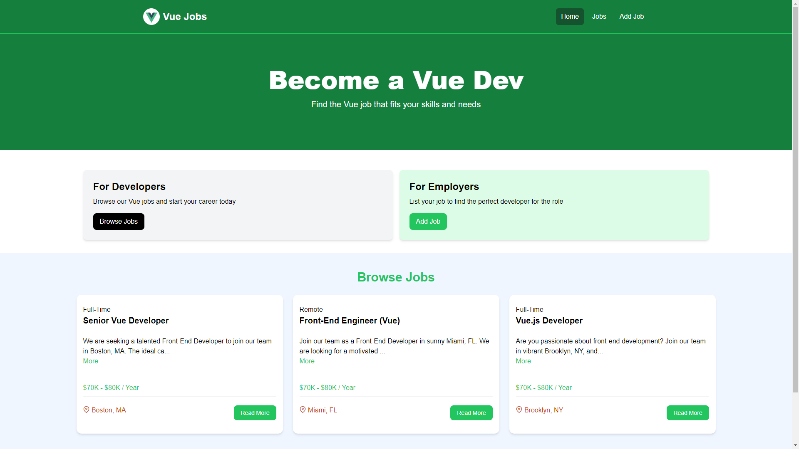

<!--
*** This README is built upon the Best-README-Template, created by Othneil Drew.
*** If you wish to use this template, go check his repository :
*** https://github.com/othneildrew/Best-README-Template/tree/master
*** And don't forget to give his project a star!
-->

<!-- PROJECT TITLE -->

  

<h1 align="center">VueJobs</h1>

<!-- ABOUT THE PROJECT -->

<h2 id="about-the-project">About The Project</h2>

If you want to take a direct look at this project, you can do so right [here](https://vuejobboard.onrender.com/).

This project was built following this [tutorial](https://www.youtube.com/watch?v=VeNfHj6MhgA).

VueJobs is a Job Board WebApp built using [Vue.js](https://vuejs.org/), [Express.js](https://expressjs.com/), [Node.js](https://nodejs.org/en) and [MongoDB](https://www.mongodb.com/).

The data is stored on [MongoDB Atlas](https://www.mongodb.com/products/platform/atlas-database).

This project is hosted on [Render](https://render.com/) and utilizes their power-efficient servers, which spin down after periods of inactivity. As a result, you may experience a slightly longer loading time as the server spins back up for use.

(<a href="#readme-top">back to top</a>)

